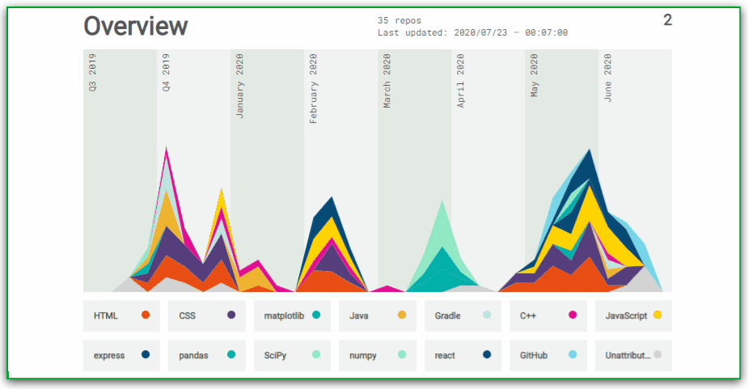

# Hello, geeks! 👋

I am _Garima Singh_. I have strong media and communication professional with a Bachelor of Technology focused in Computer Science and engineering from _National Institute of Technology, Patna_. I am an experienced developer skilled in C++, Java, Android Development, Full Stack Development, Machine learning, MERN, Javascript and its frameworks. My activities are much beyond my stream of education. ⚡ I am involved in a lot of *organizational works* in college related to clubs, hackathons, fests and workshops and helped in building many communities from scratch.

### 😄 Pronouns
She/Her

### 🌱 What do I do and What have I done? 

- Mentor at OpenMined and Ex-Mentor at AnitaB Organisation for Open Source Hack 2020
- Recipient of Twitter #DevelopHer India 2020 Scholarship, Bertelsmann Scholarship 2020 and Machine learning Scholarship, Microsoft Azure by Udacity 
- Mentor and Project Admin at Kharagpur Winter of Code, IIT Kharagpur 2020-21, NJACK Winter of Code, IIT Patna 2020-21, Script Winter of Code 2021, Student Code-in 2020, Build with LetsUpgrade 2020, Contributors's Hack Hackin Codes 2020. 
- Core Team Member at Developer Student Club, NIT Patna and Hackslash Mozilla Campus Club
- Alexa Student Influencer 2020 and Chapter Lead at Alexa Dev Hub
- Current Intern at GeeksForGeeks and Past Full Stack Development Intern at Dataly Services 
- Course Curator at Uaceit- Ace at your pace and Mission Advocate at Widhya Technologies
- Global Ambassador at WomenTech Network, Auth0, Girls who Code and GirlUp Foundation

### ⚡ One line that describes me best? 
An ambitious girl who loves to cook fries, day dream at nights and sometime codes too.😉😉

### 📫 How to reach me?
- [Twitter](https://twitter.com/garingh128) 
- [LinkedIn](https://www.linkedin.com/in/garima-singh-34042a177/) 
- [My personal portfolio](http://garimasingh.me) 
- My personal blog- [Garima Codes](https://garimasingh.netlify.app/)
- [Medium](https://medium.com/@garingh128)
- [Sourcerer](https://sourcerer.io/garimasingh128)

You can ask me anything (within reason). I am looking forward to absorb knowledge🧠,gain experience 🏭, collaborate🤝 and build amazing products 🏭for the world🌍!

 
  Visitors count 
  

  

***

<!--
**garimasingh128/garimasingh128** is a ✨ _special_ ✨ repository because its `README.md` (this file) appears on your GitHub profile.

Here are some ideas to get you started:

- 🔭 I’m currently working on ...
- 🌱 I’m currently learning ...
- 👯 I’m looking to collaborate on ...
- 🤔 I’m looking for help with ...
- 💬 Ask me about ...
- 📫 How to reach me: ...
- 😄 Pronouns: ...
- ⚡ Fun fact: ...
-->

